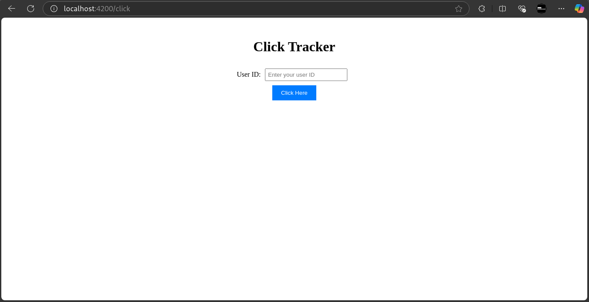
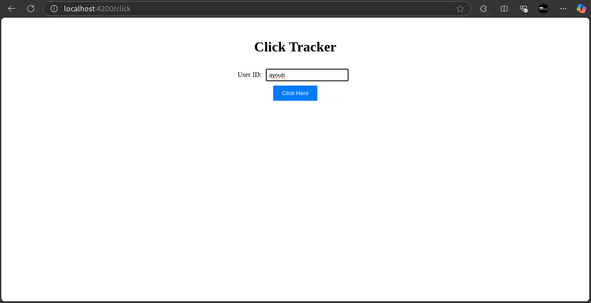
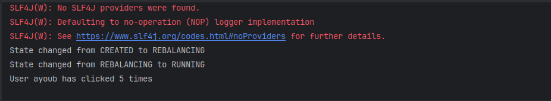
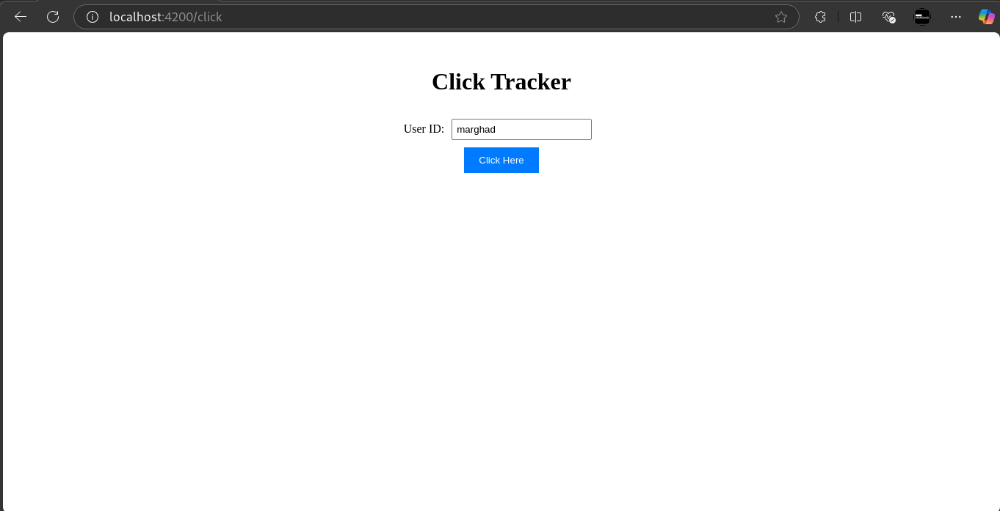
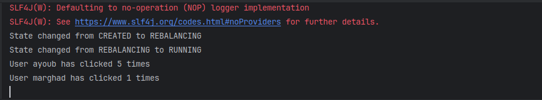
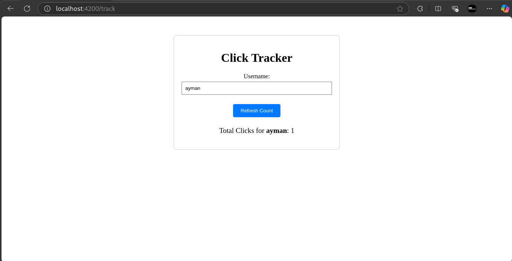

# Real-Time Click Tracking and Analysis with Kafka Streams and Spring Boot


## Introduction
This project demonstrates how to build a real-time click tracking and analysis system using Kafka Streams and Spring Boot. The system allows users to click a button on a web interface, records each click in real-time, processes the data using Kafka Streams, and exposes the total click count via a REST API.

## Project Overview

The project consists of three main components:

**Web Producer:** A Spring Boot web application that sends click events to a Kafka topic.

**Kafka Streams Application**: A Kafka Streams application that processes click events and calculates the total number of clicks.

**REST Consumer**: A Spring Boot application that consumes the processed data from Kafka and exposes it via a REST API.

**UI Application** : An Angular app is used to visualise and consume APIs of rest consumer and Producer

## Setup Kafka Cluster

A Kafka cluster consists of multiple Kafka brokers, with Zookeeper serving as the cluster manager. Docker compose `compose.yaml` file is used to start up cluster.

```yaml
services:
  zookeeper:
    image: confluentinc/cp-zookeeper:latest
    container_name: zookeeper
    environment:
      ZOOKEEPER_CLIENT_PORT: 2181
      ZOOKEEPER_TICK_TIME: 2000
    ports:
      - "2181:2181"

  kafka:
    image: confluentinc/cp-kafka:latest
    container_name: kafka
    depends_on:
      - zookeeper
    environment:
      KAFKA_BROKER_ID: 1
      KAFKA_ZOOKEEPER_CONNECT: zookeeper:2181
      KAFKA_ADVERTISED_LISTENERS: PLAINTEXT://localhost:9092
      KAFKA_OFFSETS_TOPIC_REPLICATION_FACTOR: 1
    ports:
      - "9092:9092"
```

We need to create two requires topics :
- `clicks` : This topic tracks each instance when a user clicks the button.

```bash
docker compose exec -it kafka kafka-topics --create --topic clicks --bootstrap-server kafka:9092 --partitions 3 --replication-factor 1
```

- `click-counts` : This topic maintains the cumulative total of clicks for each user

```bash
docker compose exec -it kafka kafka-topics --create --topic click-counts --bootstrap-server kafka:9092 --partitions 3 --replication-factor 1
```

## Web producer
The Web Producer is a Spring Boot application that serves as the entry point for user interactions. It provides a simple web interface with a button that users can click. Each click event is captured and sent to a Kafka topic.

The application uses Spring Kafka to produce messages to the `clicks` topic.
Each message contains a key (e.g., `userId`) and a value (`click`) to represent the action.

For that purpose, a REST controller `ClickController` handles HTTP request to publish clicks to Kafka

```java
@RestController
public class ClicksController {
    private final KafkaTemplate<String, String> kafkaTemplate;

    public ClicksController(KafkaTemplate<String, String> kafkaTemplate) {
        this.kafkaTemplate = kafkaTemplate;
    }

    @GetMapping("/click")
    public void recordClick(@RequestParam String userId) {
        kafkaTemplate.send("clicks", userId, "click");
    }
}
```

## Kafka Streams Application

The Kafka Streams Application is responsible for processing click events in real-time. It consumes messages from the `clicks` topic, aggregates the data, and calculates the total number of clicks.

The application uses Kafka Streams to perform real-time aggregation. The total click count is maintained as a stateful aggregate.


```java
Properties props = new Properties();
props.put("bootstrap.servers", "localhost:9092");
props.put("application.id", "clicks-counter");
props.put("auto.offset.reset", "earliest");
props.put("default.key.serde", Serdes.String().getClass());
props.put("default.value.serde", Serdes.String().getClass());

StreamsBuilder builder = new StreamsBuilder();

KStream<String, Long> clicks = builder.stream("clicks");

KStream<String, Long> total = clicks.groupByKey()
        .count(Materialized.as("click-count-store"))
        .toStream();
total.foreach((userId, count) -> System.out.printf("User %s has clicked %d times\n", userId, count));
total.to("click-counts");

KafkaStreams streams = new KafkaStreams(builder.build(), props);
streams.setStateListener((newState, oldState) -> System.out.printf("State changed from %s to %s\n", oldState, newState));
streams.start();
Runtime.getRuntime().addShutdownHook(new Thread(streams::close));
```


## REST consumer
The REST Consumer is a Spring Boot application that consumes the processed click counts from the `click-counts` topic and exposes them via a REST API.

The application provides real-time access to the total click count. t uses Spring Kafka to consume messages from the `click-counts` topic. A simple endpoint (`GET /clicks/count`) is exposed to retrieve the total click count.

A Kafka consumer (`ClickConsumer`) listens to the `click-counts` topic and updates the total click count.

```java
@Service
public class ClickConsumer {
  private final Map<String, Long> clickCounts;

  public ClickConsumer() {
    this.clickCounts = new HashMap<>();
  }

  @KafkaListener(topics = "click-counts", groupId = "click-counts")
  public void consume(ConsumerRecord<String, Long> record) {
    clickCounts.put(record.key(), record.value());
  }

  public long getTotalClicks(String userId) {
    return clickCounts.getOrDefault(userId, 0L);
  }
}
```

A REST controller (`ClickCountController`) exposes the total click count via an HTTP endpoint.

```java
@RestController
@RequestMapping("clicks")
public class ClickCountController {

  private final ClickConsumer clickConsumer;

  public ClickCountController(ClickConsumer clickConsumer) {
    this.clickConsumer = clickConsumer;
  }

  @GetMapping("count")
  public Map<String, Long> getClickCount(@RequestParam String userId) {
    return Map.of("clicks", clickConsumer.getTotalClicks(userId));
  }
}
```

## Simulation














